# Tracemind

**See your code think.** A LeetCode interview-prep workspace for students who are
also taking a data structures course (UIUC CS 225). Learn the interview patterns,
look up the data structures underneath them, and paste any Python you write to
watch it run line by line.

**▶ Live: [arinazhou.github.io/tracemind](https://arinazhou.github.io/tracemind/)** · free · no account · nothing to install

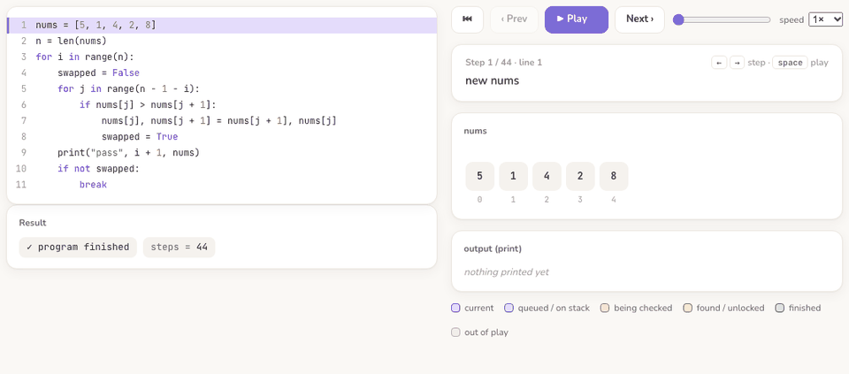

- [What's inside](#whats-inside)
- [Search: find any problem's topic](#search-find-any-problems-topic)
- [Visualize your own code: step-by-step guide](#visualize-your-own-code-step-by-step-guide)
  - [1. A normal Python program](#1-a-normal-python-program)
  - [2. A LeetCode solution](#2-a-leetcode-solution)
  - [3. A class with several calls (design problems)](#3-a-class-with-several-calls-design-problems)
  - [Reading the animation](#reading-the-animation)
  - [Big-O analysis](#big-o-analysis)
  - [When something goes wrong](#when-something-goes-wrong)
- [Learn: interview patterns](#learn-interview-patterns)
- [Data structures: CS 225 reference](#data-structures-cs-225-reference)
- [Tracker](#tracker)
- [Accounts: sync across devices](#accounts-sync-across-devices)
- [Run it locally](#run-it-locally)
- [How it works](#how-it-works)

---

## What's inside

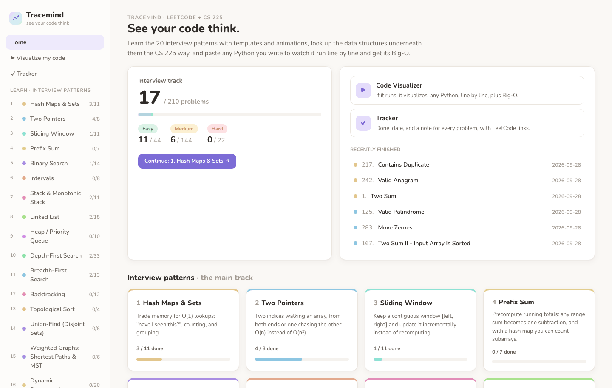

| Part | What it's for |
|---|---|
| **Learn · 20 interview patterns** | The main track. Hash maps, two pointers, sliding window, binary search, BFS/DFS, DP… each with templates, a worked example you can step through, complexity, pitfalls, and a staged problem list (210 LeetCode problems). |
| **Data structures · CS 225** | Short reference pages (arrays, linked lists, trees, heaps, hashing, disjoint sets, graphs…) with links to CS 225's **annotated lecture notes**. |
| **▶ Visualize my code** | Paste *any* Python that runs, then step through it line by line and get its Big-O. |
| **✓ Tracker** | Done ✓, the date you finished, a one-line note, and a link to each LeetCode problem. |
| **🔍 Search** | Type a problem number or name and jump straight to the topic that teaches it. |

---

## Search: find any problem's topic

Click **🔍 Search problems…** at the top of the sidebar, or press <kbd>⌘</kbd>/<kbd>Ctrl</kbd> + <kbd>K</kbd>
(or <kbd>/</kbd>) on any page. Type a problem **number** (`207`), part of its **title**
(`longest substring`, any word order), a **nickname** (`3sum`, `lru`, `bst`, `lca`), or an
**algorithm** (`dijkstra`, `kahn`, `avl`). Small typos are fine.

Each result shows the problem's difficulty, a ✓ if you've done it, and **the topic it belongs to**:

- <kbd>Enter</kbd> (or click) opens **the topic lesson**, scrolled to that problem with it highlighted in the practice list
- <kbd>⌘</kbd>/<kbd>Ctrl</kbd> + <kbd>Enter</kbd> opens the problem's own page (animation, your solution, notes)
- <kbd>↑</kbd> <kbd>↓</kbd> move · <kbd>Esc</kbd> close

Searching for a problem that isn't in the catalog (e.g. *Meeting Rooms III*) shows the closest
problems that are (*Meeting Rooms*, *Meeting Rooms II* → **Intervals**), because their topic is
usually the one to study, plus a link to search LeetCode.

---

## Visualize your own code: step-by-step guide

Open **▶ Visualize my code** in the sidebar
([direct link](https://arinazhou.github.io/tracemind/#/visualize)). The page has
three numbered steps:

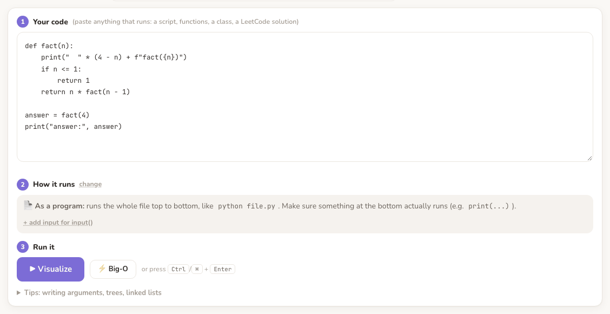

1. **① Your code**: paste your Python into the editor.
2. **② How it runs**: Tracemind works this out by itself and tells you in one sentence. You rarely need to touch it.
3. **③ Run it**: press **▶ Visualize** (or <kbd>Ctrl</kbd>/<kbd>⌘</kbd> + <kbd>Enter</kbd>). The animation appears below.

Then step through it with **Next ›** / **‹ Prev**, the <kbd>←</kbd> <kbd>→</kbd> keys,
or **▶ Play** (<kbd>space</kbd>). Drag the slider to jump anywhere.

> The first run downloads Python into your browser, which takes a few seconds.
> After that, runs are instant. Your code never leaves your computer.

New here? Pick something from **"New here? Load an example"** above the editor and
just press ▶ Visualize.

### 1. A normal Python program

Paste the whole file, exactly as you'd run it with `python file.py`. Step ② says
**📄 As a program**.

```python
def fact(n):
    print("  " * (4 - n) + f"fact({n})")
    if n <= 1:
        return 1
    return n * fact(n - 1)

answer = fact(4)
print("answer:", answer)
```

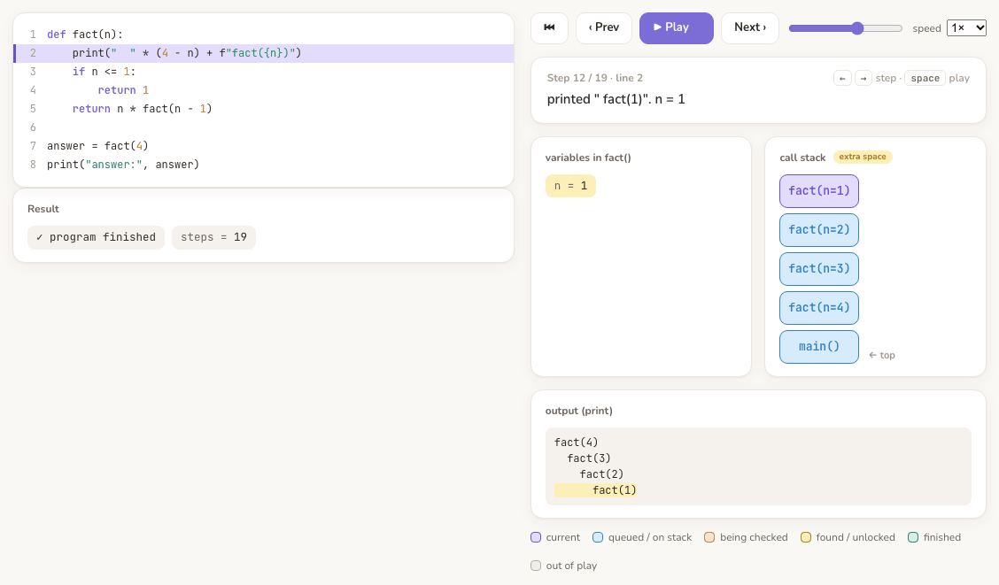

You'll see each variable, the **call stack** growing and shrinking (`main → fact(4) → fact(3) → …`),
and the **output** panel filling up as `print` runs. The highlighted text is what *this*
step printed.

- **Your program has to actually do something at the bottom.** A file that only *defines*
  functions has nothing to run. Add a call like `print(solve([3, 1, 2]))`.
  (If you paste just a function with no call, Tracemind switches to LeetCode mode and calls it for you with sample arguments.)
- **Uses `input()`?** A **stdin** box appears. Type what the program should read, one line per `input()` call:

  ```python
  n = int(input())                          # stdin line 1:  3
  values = list(map(int, input().split()))  # stdin line 2:  10 20 30
  print(sum(values) / n)
  ```

### 2. A LeetCode solution

Paste your `class Solution` exactly as you submitted it. Step ② says
**🧩 As a LeetCode-style function** and shows the call, with the **arguments
already filled in with sample values** based on the parameter names:

```
Solution().twoSum( [2, 7, 11, 15], 9 )
                   └── replace these with your own test case
```

Arguments are ordinary Python values separated by commas:

| Parameter type | Write it as |
|---|---|
| list / string / number | `[2, 7, 11, 15], 9` · `"abcabcbb"` (text needs quotes) |
| 2-D grid | `[[1, 1, 0], [0, 1, 0], [0, 0, 1]]` |
| `TreeNode` (`root`) | `tree([3, 9, 20, None, None, 15, 7])` (LeetCode's level-order list) |
| `ListNode` (`head`) | `linked([1, 2, 3, 4])`; `linked([3, 2, 0, -4], pos=1)` makes a cycle |

Pointer variables are drawn right onto the structure. Here `prev`, `cur` and `head` sit on a
linked list halfway through being reversed, and the result reads `4 → 3 → 2 → 1`:

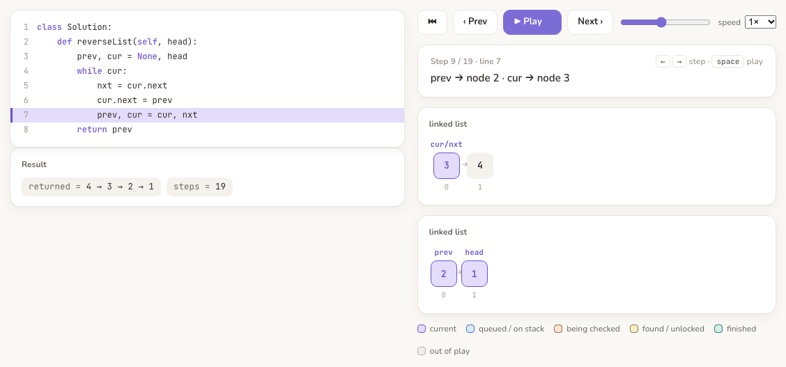

Integer variables with index-like names (`i`, `j`, `left`, `right`, `lo`, `hi`, `mid`,
`slow`, `fast`…) become arrows over your arrays:

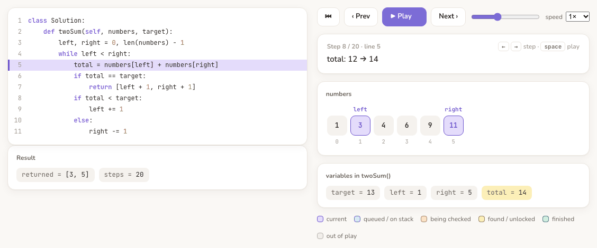

**Shortcut:** every problem page has a **⚡ My solution** tab with the same tool. Your code is
saved there with that problem, and the arguments are pre-filled (the lesson's example when
there is one, sample values otherwise).

### 3. A class with several calls (design problems)

For problems like *Min Stack* or *LRU Cache*, click **change** next to step ② and choose
**Driver code**. Then write the calls you want to watch; the last line's value is the result:

```python
s = MinStack()
s.push(5)
s.push(2)
s.getMin()
```

Your own objects are shown by their fields (e.g. `s: MinStack object` with `.stack = [...]`).

### Reading the animation

| Where | What it shows |
|---|---|
| **Code** (left) | The purple line is the line that just ran. |
| **Note** (top right) | What that line did, in words: `` `while left < right` is True ``, `pal.append('bob')`, `seen['bob'] = 3`, `prev → node 2`, `printed "fact(1)"`. |
| **Panels** | Every variable: arrays (with pointer arrows), dicts, sets, stacks, queues, grids, trees, linked lists, your objects. Values that just changed are highlighted. |
| **call stack** | Which function calls are waiting on each other (recursion!). The top frame is the one running. |
| **output (print)** | Everything printed so far; this step's output is highlighted. |
| **Result** (left, under the code) | The return value (LeetCode mode) or "program finished", plus the number of steps. |

Colors: <kbd>purple</kbd> current · <kbd>blue</kbd> queued / on the call stack ·
<kbd>orange</kbd> being checked · <kbd>yellow</kbd> just changed / found · <kbd>green</kbd> finished · <kbd>gray</kbd> out of play.

### Big-O analysis

Press **⚡ Big-O** next to ▶ Visualize. It reads your code (loops, recursion, sorting, heaps,
hash lookups, BFS queues, union-find…) and explains its estimate line by line:

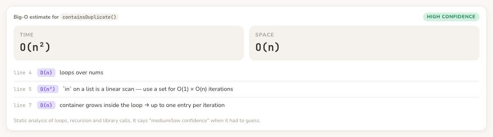

It's a static estimate, not a proof. When it has to guess, it says **medium** or **low
confidence** instead of pretending.

### When something goes wrong

Errors are explained in plain words under the Run button. The steps up to the error are
kept, so you can step back and see the values that caused it.

| You see | Do this |
|---|---|
| "Your function needs another argument…" | Fill in step ②'s arguments (one per parameter). |
| "`x` is used before it exists…" | A typo, or a variable used before it's assigned. Text arguments need quotes. |
| "input() ran out of lines…" | Type the program's input in the **stdin** box. |
| "The indentation is off…" | Use 4 spaces per level. <kbd>Tab</kbd> in the editor inserts 4 spaces. |
| "Stopped after 1500 steps" | Use a smaller input, or look for an infinite loop. |
| "ran for more than 8 seconds and was stopped" | Almost always an infinite loop. |
| Nothing interesting happens | Your file only defines things. Call your function at the bottom, or paste it alone (LeetCode mode). |

**Limits:** Python only (standard library, no `pip install`); up to 1,500 steps per run;
no files, network or GUI. For animation, small inputs are best anyway.

---

## Learn: interview patterns

20 lessons in learning order: hash maps → two pointers → sliding window → prefix sum →
binary search → intervals → stacks → linked lists → heaps → DFS → BFS → backtracking →
topological sort → union-find → weighted graphs → DP → greedy → trie → cyclic sort → matrices.

Every lesson follows the same shape:

1. **Recognize it**: signals in the problem statement that point to this pattern
2. **Templates**: fill-in code shapes, with the steps for filling them in
3. **Watch it run**: a worked example you can step through (some have extra hand-built animations)
4. **Complexity**: a table of time/space and why
5. **Strategies & pitfalls**, plus a **CS 225 connection** box
6. **Practice**: problems from easy to hard; hints stay hidden until you ask

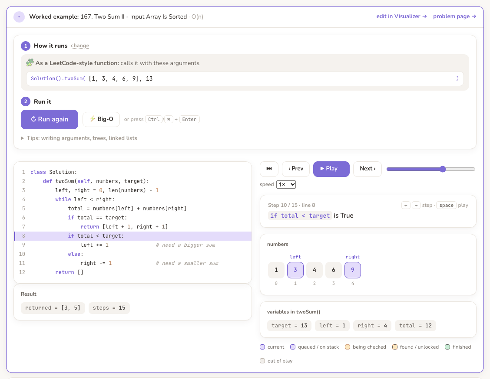

---

## Data structures: CS 225 reference

Nine short pages that follow UIUC CS 225, translated to Python: arrays & dynamic arrays,
linked lists, stacks & queues, trees & BSTs (a full interactive lesson), balanced trees
(AVL, B-trees, k-d trees), heaps, hash tables, disjoint sets, and graphs. Each page has the
Python toolkit, an operations/cost table, the key CS 225 ideas, the interview patterns that
use it, and links to the course's lecture notes: **annotated notes** first (the slides as
written on in lecture), blank slides second.

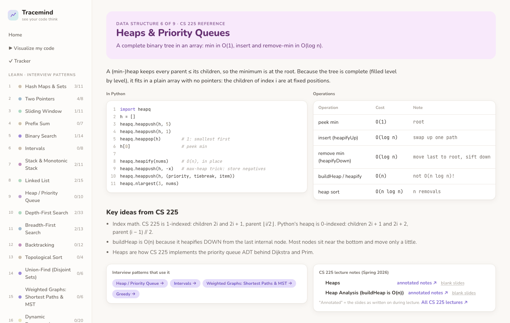

The Trees page is a full lesson with a tree explorer. Click any node to see its depth,
height and subtree size, and watch "full / perfect / complete" update:

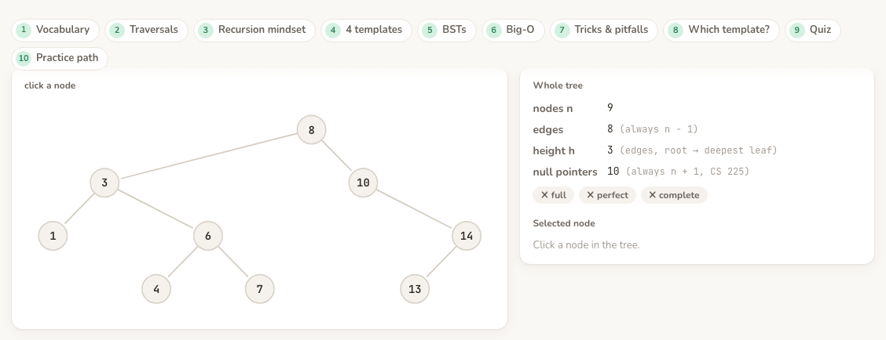

---

## Tracker

Deliberately small: check a problem off when LeetCode accepts it (today's date is filled
in and editable), jot a one-line note, and jump to LeetCode.

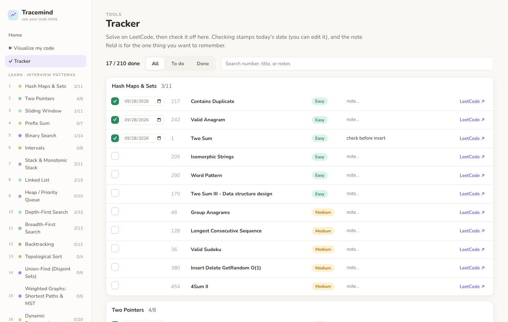

On the hosted site, progress is saved **in your browser**. Use **Back up / Restore** at the
bottom of the sidebar to keep a copy or move to another computer.

---

## Accounts: sync across devices

Click **Sign in** at the bottom of the sidebar and use **Continue with Google** or an email and
password. Your done ✓, dates, notes and solutions are then saved to your account and appear
on every device, live. The first time you sign in, any progress already saved in that browser
is moved into your account.

- **Only you can see your records.** This is enforced by Firestore security rules
  ([`firestore.rules`](firestore.rules)) on Google's servers, and tested in CI.
- **Sign out** removes your records from that browser (safe on shared computers).
- **Delete my data** (under your name in the sidebar) erases everything in your account.
- Not signed in? Everything still works: progress is saved in your browser, with Back up / Restore.

Setting up the Firebase project behind this takes about 5 minutes: see
[`docs/FIREBASE_SETUP.md`](docs/FIREBASE_SETUP.md).

---

## Run it locally

Requires Python 3.11+ and Node 20+.

```bash
git clone https://github.com/arinazhou/tracemind.git
cd tracemind
./dev.sh      # API on :8000 + web app on http://localhost:5173 (hot reload)
./start.sh    # or: build once and serve everything from http://localhost:8000
```

Locally, progress is stored in `server/tracemind.db` (SQLite). That file is all your data,
so copy it to back up.

---

## How it works

```
web/src/learn/          the curriculum, as plain data
  patterns/*.ts         20 pattern lessons: templates, tips, staged problems
  dataStructures.ts     CS 225 reference pages (+ lecture-note links)
  examples/*.py         one runnable worked example per pattern
web/src/lab/
  pytrace.py            runs your code under sys.settrace; snapshots every variable after each line
  pyWorker.ts           Python (Pyodide / WebAssembly) in a Web Worker, so a stuck loop can't freeze the page
  traceToSteps.ts       snapshots → panels, pointer arrows, and the plain-English notes
  friendly.ts           sample arguments and error explanations
web/src/animations/     13 hand-built animations (graph layouts, bars, water levels…)
server/app/
  analyzer.py           the Big-O estimator (the same file also runs in the browser)
  main.py, db.py        FastAPI + SQLite progress API for local use
```

Accounts use Firebase Auth + Firestore (`web/src/cloud/`, rules in `firestore.rules`).

Every push runs the full test suite in GitHub Actions and redeploys only if it passes:

```bash
.venv/bin/pytest server     # analyzer, API, tracer, and every lesson example
                            #   (right answer, clean trace, analyzer agrees or admits doubt)
cd web && npx tsc -p .      # typecheck
cd web && npm run check     # every hand-built animation vs. the real Python solution
cd web && npm run test:rules  # Firestore rules in the emulator: users can only reach their own data
```

## References

- [Hello Interview](https://www.hellointerview.com/learn/code): the interview-pattern curriculum
- UIUC CS 225 [lectures (Spring 2026)](https://courses.grainger.illinois.edu/cs225/sp2026/pages/lectures.html): the data structures
